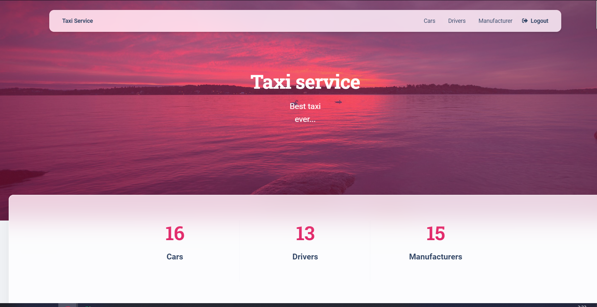

# taxi-service

Django project for managing taxi service

# Installation

Python3 must be already installed

```shell
git clone https://github.com/Pavilion4ik/taxi-service.git
cd taxi_service
python3 -m venv venv
source venv/bin/activate
pip install -r requirements.txt
python manage.py runserver
```

# Features

* Authentication functionality for Driver/User
* Managing cars, drivers and manufacturers directly from website
* Powerful admin panel for advanced  managing
* Possibility of commenting and rating of car
* Functionality of adding avatars for drivers and images for cars

## Demo
